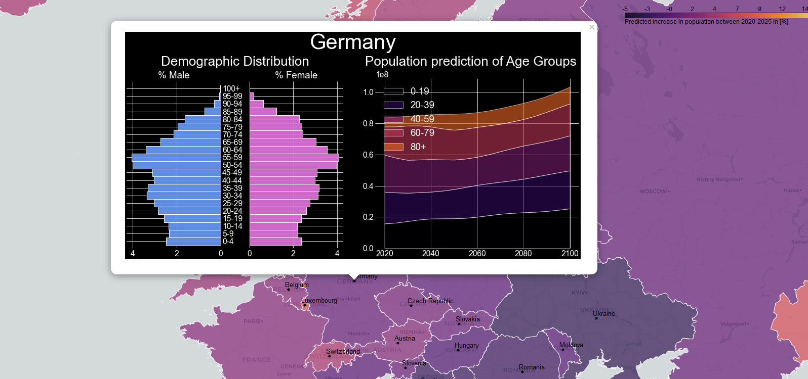

# Introduction to Visualizations with matplotlib and folium

This repository contains the script presented during my workshop on visualization techniques and general best practices in data science projects as part of my handover in the SGFG, at THU Ulm. Multiple plots, containing demographic pyramids as well as population predictions for different age groups per couintry are created, in addition to an interactive html heatmap with embedded popup windows. The underlying data was obtained from the official [UN webpage](https://population.un.org/wpp/Download/Standard/CSV/). 

The repository is structured as follows:

- [Introduction to Visualizations with matplotlib and folium.ipynb](./Introduction to Visualizations with matplotlib and folium.ipynb) is the main notebook, containing the code and documentation
- [results](./results/) is the directory containing the resulting html file, as well as the plots per country in a further subdirectory
- [data](./data/) is the directory containing the input data: a geojson file with geographical boundaries and a csv datafile with the population data
- [images](./images/) contains a static image of the interactive map  
